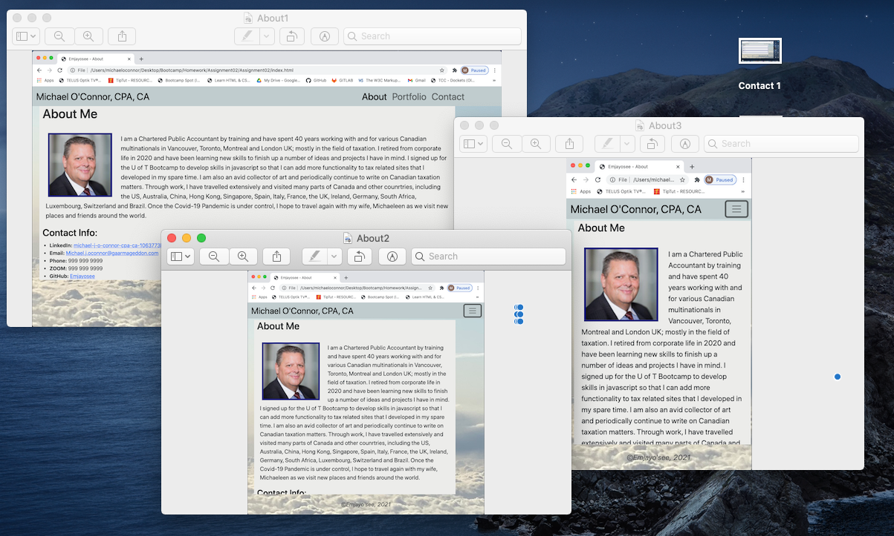

# Assignment02
This is the # Unit 02 CSS and Bootstrap Homework: Responsive Portfolio Assignment

# Unit 02 CSS and Bootstrap Homework: Responsive Portfolio Assignment

Portfolio: January 19, 2021, Michael O'Connor, WebDev Wannabe, 604 765-6061

# 01 Goal: The Goal of this project is set up a Bootstrap CSS Framework for a mobile responsive portfolio and demonstrate an ability to integrate the HTML pages as well as use appropriate CSS to display on various sized browsers, including mobile devices.  Here is a link to the Github folder https://github.com/Emjayosee/Assignment02Supp and a link to the deployed shell https://emjayosee.github.io/Assignment02Supp/.

# 02 Approach:

    In approching this project, I took previous learnings on bio type projects to integrate and test various ways to display images in the website.  For example, some of the images are contained in the website gitbub folder, whereas, the image on myself I extracted from my Linked-IN account to ensure consitency (I used the insepect feature to identify the location of that image).

# 03 Testing and Quality Control:

    1. I have tested each link to confirm functionality.

    2. HTML Code has been formatted to make it easier to follow when viewed at source.

    3. I have loaded the files and tested the page functionality at GITHUB.

    4. I learned how to get the correct folder at the terminal level using "New Terminal at Folder" feature in the Apple menu.  No more repeatedly typing cd!!!

    5. I got more comfortable using the inspect feature of the Chrome dev tools to test various margins and padding around elements.

    6. I ran the html through a code validation service a few times while developing as well as on the final commit.  I used validator.w3.org and the test identifies a stray ending div tag, a duplicate attribute class (in the 9 images) each of which I was able to consider, before final testing.  The former I adjuested the latter I ignored as the changed destabilized the images.

# 04 Lessons Learned:

The following items should be considered for future enhancements, time and budget permitting:

    1. I learned how to use the W3 Code Validation service.

    2. I saw how HTML pages interact with one another.

    3. Remove unnecessary classes and elements.

    4. I have learned that solutions to coding debugging are dependent on the code itself, so that all debugging has to be done contextually in light of the other element and styling.

    5. Test the contrast for vision accessibility on a reliable site.

    6. If it ain't broken, don't fix it.

# 05 Further improvements to make:

    1. Incorporate social media link buttons for twitter, facebook and youtube.  Media queries have been minimized in this version of the portfolio as instructed.

    2. Add actual links to social media, linked-in and youtube (I do not use facebook).  I held off on personal contact detail for future effort.

# 06 Current Renderings:

See Current Rendering at the time of writing in the Assignment01 Repo. 
 
 
 